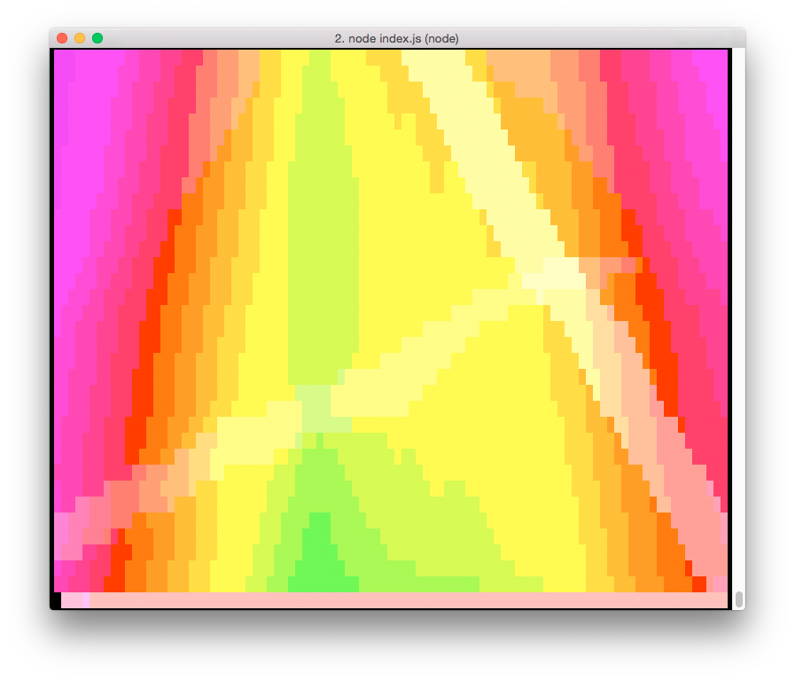
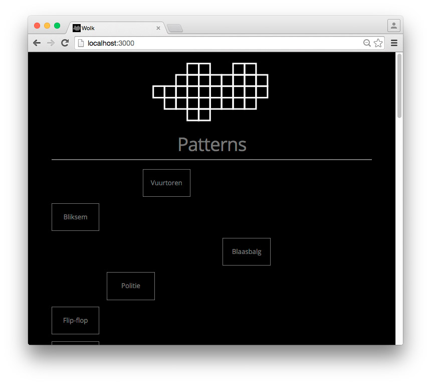

# wolkd

Node.js server and user interface to control WS2801 RGB LED strips via SPI. Built to control [wolk.bike](http://wolk.bike), a __two-person bicycle sound system cloud__ commissioned by [Welcome to the Village 2015](http://welcometothevillage.nl/project/de-wolk).

wolkd can display mathematical functions, frame-by-frame animations (and even animated GIFs!) on RGB LED strips, and can be controlled via a [web interface](#user-interface) — with your laptop, smartphone or tablet. wolkd lets you write animations in terms of either a pixel's LED strip index or x and y coordinates using a [mapping file](#mappings). And wolkd has a 256 color ANSI terminal debug mode!

wolkd works well in conjunction with [LED Strip Mapper](https://github.com/bertspaan/led-strip-mapper).


See [http://wolk.bike](http://wolk.bike) for more photos!

[](https://asciinema.org/a/8juh4s3inn0pdwep6036rpgid)

## Installation

    git clone https://github.com/bertspaan/wolkd.git
    cd wolkd
    npm install

If your device has an SPI interface (Raspberry Pis have one!), you can install [node-spi](https://github.com/RussTheAerialist/node-spi):

    npm install spi

Please note: without node-spi, wolkd will run in console mode!

wolkd expects the environment variable `WOLKD_CONFIG` to point to the path of the wolkd configuration JSON file.

    cp wolkd.example.config.json ~/wolkd.config.json
    export WOLKD_CONFIG=/home/wolk/wolkd.config.json

wolkd's [configuration](#configuration) and [command line arguments](#command-line-arguments) are described in detail below.

To run wolkd, type:

    node index.js

When running wolkd on your laptop and/or in console mode, the RGB LED output is mapped to the terminal:



## User interface

After starting wolkd, a web interface to control wolkd and mix patterns is available on [http://localhost:3000](http://localhost:3000/):



## Patterns

wolkd supports two kinds of patterns:

1. __Functions__: functions are executed every frame for each active pattern
2. __Frames__: frames are hard-coded arrays of pixel colors.

Function:

```js
module.exports =  {
  title: 'Function',
  getPixel: function(beat, t, i, x, y) {
    // beat: beat number
    // t: frame number
    // i: pixel index
    // x: x coordinate of pixel, according to mapping
    // y: y coordinate of pixel, according to mapping
    return [r, g, b];
  }
};
```

Frames:

```js
module.exports = {
  title: 'Frames',
  frames: [
    [
      [0, 0, 0],     // Frame 1, pixel 1
      [255, 0, 0],   // Frame 1, pixel 2
      ...
    ],
    [
      [0, 255, 0],   // Frame 2, pixel 1
      [255, 255, 0], // Frame 2, pixel 2
      ...
    ],
  ]
};
```

TODO: animated GIFs!

## Screens

Each frame, wolkd outputs its pixel data to a screen. Currently, wolkd has two screens available: `spi` and `console`.

It's easy to add your own screens, by creating a JavaScript file in the [`screens`](screens) directory.

```js
exports.setPixel = function(pixel, r, g, b) {
  // Set RGB color of individual indexed pixel in buffer
}

exports.update = function update() {
  // Send buffer to screen, called each frame
}
```

## Mappings

wolkd uses a JSON mapping file to convert a pixel's LED strip index to its x and y coordinates (between 0 and 1). You can use [LED Strip Mapper](https://github.com/bertspaan/led-strip-mapper) to generate such patterns from an SVG file.

You can find wolkd's mappings in the [`mappings`](mappings) directory

## Autopilot

Autopilot is __very smart__ and can create beautiful random patterns!

## Configuration

```js
{
  "pixels": 100,                // Number of pixels on LED strip
  "framerate": 30,              // Framerate wolkd tries to achieve
  "bpm": 120,                   // Default BPM
  "framesPerBeat": 16,          // Frames per beat - constant if BPM changes
  "spi": {
    "device": "/dev/spidev0.0"  // SPI device
  },
  "autopilot": {
    "enabled": true,            // Enable/disable [autopilot](#autopilot)
    "inputTimeout": 120000,     // Time in milliseconds before autopilot starts
                                //   after user input
    "patternTimeout": 60000     // Time after which autopilot changes patterns
  },
  "mapping": "st-bree",         // Default [mapping file](#mappings)
  "screen": "spi",              // Default [screen](#screens)
  "hostname": "wolkd.local",    // Used by web interface
  "websocket": {
    "port": 8080                // Used by web interface
  },
  "http": {
    "port": 3000                // Used by web interface
  }
}
```

## Command line arguments

You can override some of the options set in the configuration file with the following command line arguments:

| Argument                   | Example             | Description
|:---------------------------|:--------------------|:-------------
| `--screen <screen>`        | `--screen console`  | Choose [screen](#screens)
| `--mapping <mapping>`      | `--mapping wolk`    | Choose [mapping file](#mappings)
| `--autopilot <true|false>` | `--autopilot false` | Enable or disable [autopilot](#autopilot)

## Raspberry Pi

Instructions for installing wolkd on a Raspberry Pi:

- Installation: [http://raspberrypi.stackexchange.com/questions/15192/installing-raspbian-from-noobs-without-display](http://raspberrypi.stackexchange.com/questions/15192/installing-raspbian-from-noobs-without-display)
- WiFi: [https://www.raspberrypi.org/documentation/configuration/wireless/wireless-cli.md](https://www.raspberrypi.org/documentation/configuration/wireless/wireless-cli.md)
- Run `sudo raspi-config`
  - Enable SPI
  - Set locale
  - Set hostname to `wolk`
- Add user `wolk`: [https://www.raspberrypi.org/documentation/linux/usage/users.md](https://www.raspberrypi.org/documentation/linux/usage/users.md)
  - `sudo adduser wolk`
  - `sudo usermod -a -G sudo,audio,video,users,netdev,input,spi,i2c,gpio wolk`
- Login with user wolk, clone wolkd: `git clone https://github.com/bertspaan/wolkd.git`
- Install Node.js: [http://weworkweplay.com/play/raspberry-pi-nodejs/](http://weworkweplay.com/play/raspberry-pi-nodejs/)
- Install screen: `sudo apt-get install screen`
- Install nginx: [https://www.raspberrypi.org/documentation/remote-access/web-server/nginx.md](https://www.raspberrypi.org/documentation/remote-access/web-server/nginx.md)
- Add the following to the file `/etc/nginx/sites-available/wolkd`

```
server {
    listen 80;
    server_name wolk.local;
    location / {
        proxy_pass http://localhost:3000/;
    }
}
```

- `sudo ln -s /etc/nginx/sites-available/wolkd /etc/nginx/sites-enabled && sudo service nginx restart`
- Create wolkd daemon: [http://www.slidequest.com/Taboca/70ang](http://www.slidequest.com/Taboca/70ang):
  1. `sudo npm install -g forever`
  2. `sudo cp ./daemon/wolkd /etc/init.d/wolkd`
  3. `sudo chmod 755 /etc/init.d/wolkd`
  4. `sudo update-rc.d wolkd defaults`

## TODO

- Language files/config for user interface
- In UI, sliders should change when wolkd changes patterns/modifiers
- Frame animations with configurable speed
- Patterns either continuous (each frame) or per beat
- Create _programs_, combinations of patterns that work well together
- Add colors or images to buttons in user interface
- Add modifiers which change hue/color through time
- FFT audio analysis and beat detection using microphone
- Add [Open Pixel Control](http://openpixelcontrol.org/) support
- Send output to [Fadecandy Controller board](https://github.com/scanlime/fadecandy)
- Add websocket screen and HTML Canvas viewer

## See also

- [http://wolk.bike/](http://wolk.bike/)
- [https://github.com/RussTheAerialist/node-spi](https://github.com/RussTheAerialist/node-spi)
- [https://www.raspberrypi.org/documentation/hardware/raspberrypi/spi/README.md](https://www.raspberrypi.org/documentation/hardware/raspberrypi/spi/README.md)
- [https://github.com/scanlime/fadecandy](https://github.com/scanlime/fadecandy)
- [https://learn.adafruit.com/led-art-with-fadecandy/intro](https://learn.adafruit.com/led-art-with-fadecandy/intro)
