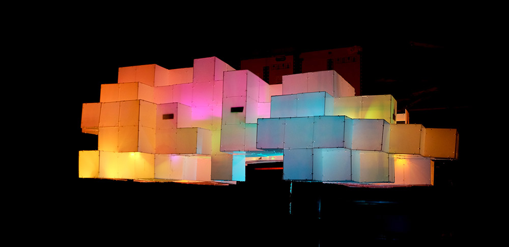

# wolkd

Server and user interface to control WS2801 RGB LED strips via SPI. Used to control [wolk.bike](http://wolk.bike), a bike skelter sound system cloud built for [Welcome to the Village 2015](http://welcometothevillage.nl/project/de-wolk) in Leeuwarden, The Netherlands.

See [wolk.bike](http://wolk.bike) for photos of wolk.bike.



## Installation

    npm install
    npm install spi

    cp wolkd.example.config.json ~/wolkd.config.json
    export WOLKD_CONFIG=/home/bert/wolkd.config.json

    node index.js

## Patterns

## Screens

Just `s.setPixel(pixel, r, g, b)` and then `s.update()` to update the screen

```js
var s = require('./lib/screen')
for(var i = 0; i < 100; i++) {
	s.setPixel(i, Math.random()*255, Math.random()*255, Math.random()*255)
}
s.update()
```

## Mappings

## Raspberry Pi

- Installation: http://raspberrypi.stackexchange.com/questions/15192/installing-raspbian-from-noobs-without-display
- WiFi: https://www.raspberrypi.org/documentation/configuration/wireless/wireless-cli.md
- Run `sudo raspi-config`
  - Enable SPI
  - Set locale
  - Set hostname to `wolk`
- Add user `wolk`: https://www.raspberrypi.org/documentation/linux/usage/users.md
  - `sudo adduser wolk`
  - `sudo usermod -a -G sudo,audio,video,users,netdev,input,spi,i2c,gpio wolk`
- Install Node.js: http://weworkweplay.com/play/raspberry-pi-nodejs/
- Install screen: `sudo apt-get install screen`
- Install nginx: https://www.raspberrypi.org/documentation/remote-access/web-server/nginx.md
- Create wolkd daemon: http://www.slidequest.com/Taboca/70ang:
  1. `sudo npm install -g forever`
  2. `sudo cp ./daemon/wolk /etc/init.d/wolkd`
  3. `sudo chmod 755 /etc/init.d/wolkd`
  4. `update-rc.d wolkd defaults`

## TODO

- programs, dir met combi's van patterns en modifiers!
- knopjes met achtergrondkleur of patroontjes!
- hue en sinus-modifier, door tijd!
 - fft/audio-in

## See also